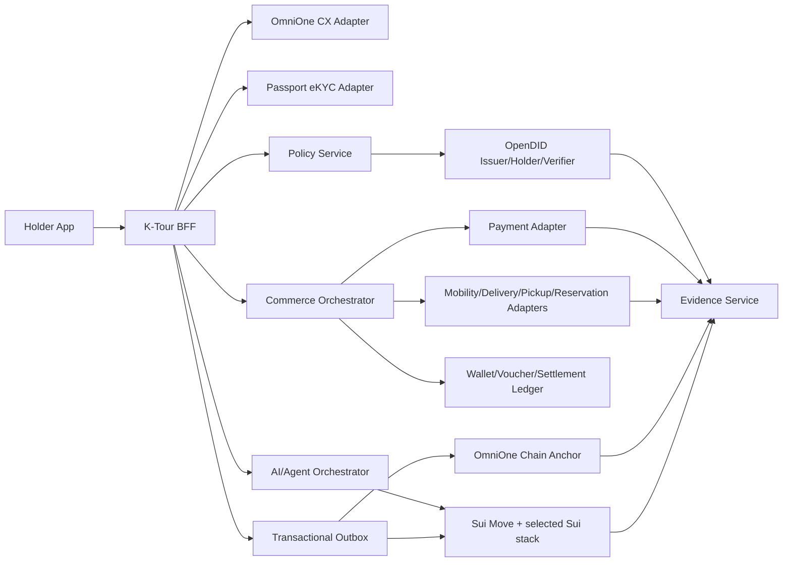

# ONDO 溫圖 — K-Tour ID 기능 개발 명세

상태: `v2.0 · 개발 핸드오프 기준 문서`

대상: 제품, 프론트엔드, 백엔드, 모바일, DID/VC, 블록체인, AI, 결제, 보안, QA, DevOps

이 문서는 ONDO 溫圖에 포함된 K-Tour ID 신원·자격 기능을 실제 제품으로 구현하기 위한 기능·비즈니스·연동·품질 계약이다. ONDO 브랜드 변경과 지도 중심 셸은 이 계약을 대체하지 않는다. 화면은 사용성 샘플이며, 이 문서의 상태·정책·데이터·증거 요구를 모두 충족해야 개발 완료로 판정한다.

관련 문서:

- [프로젝트 스코프 메모리](./PROJECT_SCOPE_MEMORY.md)
- [요구사항 추적표](./REQUIREMENTS_TRACEABILITY.md)
- [개발자 결정 목록](./DEVELOPER_DECISIONS_REQUIRED.md)
- [Sui 연동 브리프](./SUI_INTEGRATION_BRIEF.md)
- [현재 목업 아키텍처 요약](../k-tour-id-app/docs/ARCHITECTURE.md)

## 0. 규범과 상태

- `MUST`: P0 완료 전에 반드시 구현·검증한다.
- `SHOULD`: P1 기본 범위이며 제외 시 사유와 대체 통제를 기록한다.
- `MAY`: 파트너·일정·법률 조건이 충족될 때 확장한다.
- `LIVE`: 운영 공급자 receipt를 서버가 검증했다.
- `SANDBOX`: 공식 테스트 환경 receipt를 서버가 검증했다.
- `SIMULATED`: fixture/local mock이며 실제 효력이 없다.

화면, API, 로그, 발표에서 동일한 실행 수준을 사용한다.

## 1. 목적과 성공 기준

### 1.1 제품 목적

세 사용자 유형의 신원확인 결과를 하나의 민간 `KTourServiceCredential`로 정규화하고, 사용자 동의 아래 최소 자격만 제시해 여행·생활 서비스를 이용하고, 주문·환불·정산·감사까지 닫는다.

### 1.2 P0 성공 기준

1. 내국인 Mobile ID 경로가 OmniOne CX 실제 또는 공식 sandbox로 끝난다.
2. 등록 외국인 경로는 CX 지원 여부를 동적으로 확인하고, 미지원 시 오인 없는 대체 경로를 제공한다.
3. 단기 해외 방문자는 별도 Passport eKYC로 확인되며 CX로 표시되지 않는다.
4. OpenDID에서 K-Tour ID VC 발급, holder 전달/보관, VP 생성, verifier 검증, status 확인이 실행된다.
5. 최소 한 개의 marketplace 거래와 한 개의 third-party service 거래가 자격·혜택·결제·주문·환불/지원·정산까지 끝난다.
6. Sui Move package와 2개 이상 Sui 핵심 기능, Agentic AI provenance 흐름이 Testnet/Mainnet에서 재현된다.
7. 개인정보 없는 canonical event와 공급자/Sui/chain receipt가 Evidence에서 검증된다.
8. 중복·만료·거절·오프라인·부분성공·불일치가 돈/자격 손실 없이 복구된다.

### 1.3 비목표

- K-Tour ID가 정부 신분증·비자·체류 허가를 발급하는 것
- 모든 국내 앱의 기능을 K-Tour ID 내부에 복제하는 것
- 계약 없는 브랜드의 공식 제휴 주장
- 체인을 운영 DB나 결제 source of truth로 사용하는 것
- 공개 체인/Walrus에 PII·VC 원문을 저장하는 것
- AI가 신원·자격·금전의 최종 결정을 단독 수행하는 것

## 2. 사용자·조직 역할

| 역할 | 최초 확인 | 핵심 작업 |
|---|---|---|
| 단기 해외 방문자 | Passport NFC/MRZ + face/liveness | 90일 등 민간 서비스 기간의 ID, 교통·배달·체험·혜택 |
| 등록 외국인 | 지원 모바일 외국인등록증/CX 또는 승인된 대체 경로 | 생활 교통·배달·지역 혜택 |
| 내국인 국내 여행자 | Mobile ID/CX | 지역 문화·모빌리티·관광 주민 혜택 |
| 액티비티 참여자 | 활성 K-Tour ID + 참여 확정 | 그룹 채팅, 비용 나누기, 신고/차단/나가기 |
| 가맹점 직원 | 파트너 계정·등록 기기 | VP 요청, 자격 확인, 혜택 사용, 거래 receipt |
| 파트너 운영자 | 조직 관리자 | 주문·환불·정산·불일치 처리 |
| K-Tour 운영자 | 강한 관리자 인증 | issuer/policy/provider/incident/evidence 운영 |
| Agentic AI | 제한된 capability | 추천·계획·승인된 행동 실행·provenance 기록 |

## 3. 정보구조와 라우트 책임

### 3.1 사용자 앱

| 영역 | 현재 샘플 route | 생산 책임 |
|---|---|---|
| 가입/갱신 | `/onboarding` | persona, consent, provider handoff, result review, issue/renew |
| 홈 | `/` | 현재 상태, 다음 행동, first-run guide, 위치, 개인화 |
| 탐색 | `/explore` | intent/search/location/eligibility 기반 통합 서비스 목록 |
| 직접 상품 | `/explore/{id}` | 옵션, 자격, 혜택, 가격, 취소, 결제 |
| 직접 주문 | `/orders/{id}` | 이용권/예약/배달/픽업 상태, 취소·환불 |
| 외부 서비스 | `/services/{id}` | 도메인별 구성, quote, disclosure, 결제·handoff |
| 외부 주문 | `/services/orders/{id}` | provider 상태, fulfilment, 부분/전액 환불, 지원 |
| ID·지갑 | `/wallet`, `/pass` | 한 진입점 아래 credential·잔액·바우처·거래·복구 |
| 자격 제시 | `/present` | 요청 스캔, 목적/claim/보관 검토, VP, 결과·복구 |
| 혜택 완료 | `/benefits` | 혜택·결제·바우처·정산 receipt와 취소 |
| 액티비티 | `/connect` | 근처 활동, 참여, 정원, 활성 ID 검사 |
| 그룹 채팅 | `/connect/chat` | 참여자 전용 대화·안전·비용 나누기 |
| 여정 | `/journey` | 체크인·활동 기록·다음 추천 |
| 알림/지원 | `/alerts`, `/help` | 행동 가능한 알림, 주문 연결, 문의/긴급 도움 |
| 프로필 | `/profile` | 사용자 정보, 언어, 개인정보, 계정·기기 관리 |

`ID·지갑`은 하나의 하단 탭이다. 내부 subroute는 사용할 수 있지만 credential과 wallet 사이에 중복 navigation·정보 silo를 만들지 않는다.

### 3.2 파트너·운영·발표 도구

| 영역 | route | 생산 원칙 |
|---|---|---|
| 가맹점 verifier | `/partner/verify` | partner auth와 device binding 필요 |
| 정산 | `/partner/settlements` | operator RBAC, export/audit, 고객 앱과 분리 |
| 실행 증거 | `/evidence` | 사용자용 요약과 운영자용 상세를 권한 분리 |
| 발표 시나리오 | `/demo` | production nav에서 숨기고 access control |
| 기술 Q&A/architecture | `/ask`, `/architecture` | 개발/발표 보조; 소비자 제품 기능이 아님 |

## 4. 전체 사용자 플로우

### F-001 신규 가입

사전조건: local/session 계정 없음.

1. 가치·민간 자격 고지를 보여준다.
2. `단기 해외 방문 / 등록 외국인 / 내국인 국내 여행` 중 하나를 고른다.
3. 선택에 따라 Passport eKYC, CX residence card, CX Mobile ID를 시작한다.
4. 요청 주체, 목적, 요청 항목, 보관기간, 필수/선택, 철회 경로를 보여주고 동의받는다.
5. 공급자 handoff의 `created → launched → pending → result`를 canonical session에서 조회한다.
6. 이름·국적·확인 수단 등 발급에 필요한 최소 결과를 사용자가 검토한다.
7. 발급 정책을 평가하고 OpenDID로 K-Tour ID를 발급한다.
8. holder 저장과 status reference를 확인한 뒤 가입 완료로 commit한다.
9. 홈 `/?welcome=1`로 이동해 first-run guide를 한 번 보여준다.

필수 예외:

- 동의 거절, 외부 앱 미설치, QR 만료, 사용자 취소, provider 비활성, callback 위조/중복, 토큰 만료/불일치, 수동검토, holder 저장 실패, VC 발급 실패, anchor/Sui 지연.
- 발급은 성공했지만 감사 anchor가 지연되면 credential은 유지하고 evidence만 `pending`으로 분리한다.
- CX/여권 원문과 생체는 K-Tour app의 일반 로그/DB에 남기지 않는다.

완료 조건: active credential, holder confirmation, issue receipt, environment label, 홈 진입이 모두 존재한다.

단기 해외 방문자의 기본 계정 생성은 한국 휴대전화 번호를 요구하지 않는다. 이메일/OAuth/passkey/zkLogin 등 실제 채택 방식은 auth ADR에서 정하되, 신원확인용 여권 데이터가 곧 계정 비밀번호나 복구 수단이 되어서는 안 된다.

### F-002 재방문·갱신·기기 복구

- active 사용자는 홈으로 바로 들어간다.
- expiring은 방해하지 않는 배너와 만료일을 표시하고 갱신을 제안한다.
- expired/suspended/revoked는 금전·자격 작업을 차단하고 이유·복구 경로를 제공한다.
- `returnTo`는 allowlist된 내부 경로만 허용하고 갱신 후 원래 작업으로 돌아간다.
- 분실 기기는 기존 credential/status를 폐기·정지하고 새 holder key로 재인증·재발급한다.
- OAuth/zkLogin 또는 DID holder key 복구 정책은 별도 ADR에 따른다.

### F-003 first-run guide와 위치

1. 발급 완료 후 home에서 guide를 연다.
2. 위치를 쓰는 이유와 개선되는 결과를 설명한 뒤 OS permission을 요청한다.
3. 거절/불가/timeout에서도 위치 없이 계속한다.
4. 허용 시 가까운 서비스, 배달 coverage, 픽업점, 액티비티 proximity를 계산한다.
5. 사용자는 홈/탐색에서 새로고침·끄기를 할 수 있다.

MUST:

- permission 전 latitude/longitude를 요청·전송하지 않는다.
- 정확 위치를 credential, chain, AI prompt, analytics 식별자와 결합하지 않는다.
- 서버 전송 여부, 정밀도, TTL, background use를 ADR로 확정한다. 기본은 foreground·최소 정밀도·짧은 TTL이다.
- 위치가 없으면 persona/eligibility와 curated order로 정상 동작한다.

### F-010 홈과 탐색

- 홈은 credential 상태, 여행 잔액, persona별 다음 행동, 네 가지 intent 진입점을 보여준다.
- intent는 `교통 / 음식 / 쇼핑·생활 / 예약·체험`이다.
- 탐색은 marketplace와 external partner offers를 하나의 결과 목록으로 합치되 `운영 주체·실행 수준·취소 책임`을 구분한다.
- 검색은 서비스·음식·장소를 한국어/영어로 처리한다.
- 정렬은 위치 허용 시 proximity/coverage, 미허용 시 credential/persona/availability를 사용한다.
- active 주문이 있으면 단일 상태 카드로 복귀점을 제공한다.
- 결과 없음은 필터 초기화·위치 없이 보기·다른 날짜/서비스를 제공한다.

### F-020 직접 marketplace 구매

1. 상세에서 옵션·시간·언어·위치·가격·혜택·취소 규칙을 확인한다.
2. credential/persona/voucher/재고·정원을 확인한다.
3. 혜택이 있으면 F-050의 VP 동의·검증을 먼저 수행한다.
4. quote를 생성하고 gross/discount/payable/funding/cancel deadline을 고정한다.
5. 사용자가 결제수단과 금액을 재확인한다.
6. payment authorize/capture와 voucher reserve/redeem을 멱등적으로 처리한다.
7. 주문을 만들고 booking/delivery/pickup/instant fulfilment를 반환한다.
8. holder·partner·settlement가 동일 operation/receipt ID를 사용한다.

오류·복구:

- sold out → 대안
- credential 만료 → 갱신 후 복귀
- persona 부적합 → 이유와 적합한 상품
- 잔액 부족 → 충전 후 quote 재검증
- voucher 경쟁 사용 → quote/혜택 재계산 후 재동의
- 결제 성공·주문 실패 → 자동 재결제 금지, provider 재조회 후 void/refund
- 주문 성공·receipt 저장 실패 → operation ID로 복구

### F-030 third-party service 공통 흐름

1. 도메인별 필요한 구성만 받는다.
2. provider availability/coverage/stock/quote를 검증한다.
3. K-Tour 자격·혜택을 평가하고 공유 항목을 보여준다.
4. 10분 등 TTL이 있는 quote를 발급한다. 만료 후 자동 결제하지 않고 재견적한다.
5. 사용자가 외부 제공자와 K-Tour ID의 책임, 공유 정보, 금액을 동의한다.
6. 결제와 provider request를 실행하고 pending record를 즉시 남긴다.
7. deep link/app-in-app/API handoff 후 signed callback/webhook 또는 poll로 상태를 확정한다.
8. 앱으로 돌아오면 `confirmed/unknown/rejected`와 돈 상태를 함께 보여준다.
9. fulfilment·취소·부분/전액 환불·지원으로 이어진다.

MUST:

- 브랜드별 bespoke page를 늘리기보다 `MobilityAdapter`, `DeliveryAdapter`, `PickupAdapter`, `ReservationAdapter` 계약으로 확장한다.
- provider callback의 state/nonce/signature/timestamp/audience를 검증한다.
- payment, provider order, benefit reservation을 각각 기록하고 saga로 보상한다.
- 계약 전 adapter는 `SIMULATED`이고, 공식 제휴 문구를 쓰지 않는다.

### F-031 교통

택시 호출:

- pickup/destination, 차량 유형, 수하물, 예상 시간·요금, pickup 위치 확인을 받는다.
- 상태: `quoted → requested → driver-matched → arriving → onboard → arrived`.
- provider 거절은 결제 전이면 무청구, 결제 후면 void/refund와 receipt를 생성한다.
- 위치가 불확실하면 호출을 막고 핀/주소 재확인을 받는다.

교통 패스:

- 권역, 기간, 개시일, 지원 교통수단, 발급 매체, 환불 규칙을 확인한다.
- 상태: `issuing → scheduled → ready → active → expired/completed`.
- 개시 전 전액, 개시 후 잔여일/운영사 규칙에 따른 환불을 계산한다.

### F-032 음식 배달

- 주소 deliverability, 메뉴/옵션/수량, 최소 주문, 배달비, 예상시간, 전달방법을 확인한다.
- 상태: `quoted → accepted → preparing → delivering → delivered`.
- 조리 시작 전 취소, 조리 후 제공자 규칙, 누락 품목 부분환불, 전체 서비스 문제를 분리한다.
- 부분환불은 paid/benefit/platform fee/provider receivable을 비율/정책대로 다시 대사한다.

### F-033 쇼핑·편의 픽업

- 매장·재고·수량·픽업 시간·준비 SLA를 확인한다.
- 상태: `stock-reserved → preparing/packing → ready → picked-up`.
- 준비 전 취소, 재고 소실, 미수령 만료, 부분 품절의 대체/환불을 정의한다.

### F-040 ID·지갑

한 진입점 안에서 아래를 제공한다.

- credential 상태·issuer·유효기간·허용 서비스·발급 근거 요약
- present/scan, 갱신, 폐기/복구, 제시 이력
- 자산별 잔액, 출처, 법적 성격, 수수료, 거래·환불
- available/reserved/redeemed/expired voucher와 적용처
- 충전/결제수단 연결·해제, 비정상 거래 지원
- 남은 잔액의 전환 가능한 범위·비율·만료·적용처를 확인한 뒤 user-funded voucher로 전환하고, 미사용 시 원자산 환불 규칙을 제공

MUST:

- KRW, demo balance, stablecoin, point, voucher를 서로 다른 asset type으로 모델링한다.
- 서버 ledger가 잔액 source of truth다. 부동소수점 금액을 사용하지 않는다.
- top-up/pay/refund는 idempotency와 double-submit 방어가 있다.
- Sui address는 K-Tour DID나 정부 신원과 동일하지 않으며 연결 근거를 최소화한다.
- 비수탁 wallet을 표방하려면 key custody, recovery, gas, provider failure를 실제 구현·검증한다. 그렇지 않으면 비수탁이라고 표시하지 않는다.

### F-050 자격 제시·혜택·결제

1. verifier request를 QR/deep link로 연다.
2. verifier 조직, 목적, 요청 predicate/claim, 보관기간, nonce, expiry를 표시한다.
3. 사용자가 항목별로 승인/거절한다. required를 빼면 진행하지 않는다.
4. holder가 nonce/domain/audience/expiry에 바인딩된 VP를 만든다.
5. verifier가 issuer trust, signature, holder binding, expiry, status/revocation, replay를 검증한다.
6. Policy가 혜택 자격을 독립 평가한다.
7. voucher를 원자적으로 reserve/redeem하고 결제를 실행한다.
8. 동일 receipt를 holder와 merchant에 보여주고 settlement를 만든다.

결과: `verified`, `ineligible`, `expired`, `revoked/suspended`, `offline/provider-unavailable`, `replayed`, `malformed`.

개인정보는 disclosure에 표시된 항목만 전달한다. `always allow` 기본값을 두지 않는다.

### F-060 액티비티와 친구 만들기

1. 활성 K-Tour ID 사용자만 액티비티 상세·참여 조건을 본다.
2. 위치 허용 시 가까운 순, 미허용 시 관심사·언어·시간 순으로 보여준다.
3. 정원·시간·장소·예상비용·host의 K-Tour 확인 상태를 확인한다.
4. 참여 확정 뒤에만 해당 액티비티 그룹 채팅 권한을 발급한다.
5. 나가기 시 권한을 철회하고 재가입 가능 여부를 정책으로 처리한다.

안전 기능:

- block은 해당 사용자의 메시지만 숨기고 audit record를 남긴다.
- report는 최근 메시지와 activity context를 최소 범위로 보존하고 receipt ID를 발급한다.
- help는 112/1330 등 긴급/여행 지원을 명확히 구분한다.
- moderation, rate limit, spam, 악성 링크, 미성년자/연령 정책을 운영자가 정의한다.
- 성별 매칭과 공개 개인 DM은 기본 범위가 아니다.

비용 나누기:

- 참여자, 금액, 수령인/가맹점, 기한, 분담 상태를 확인한다.
- 각 참여자는 자신의 결제만 명시 승인한다.
- escrow·수령인 결제 규제와 refund가 확정되기 전에는 simulation이다.

### F-070 여행 여정

- check-in은 위치 또는 파트너 QR 등 명시된 근거로 생성한다.
- QR stamp tour는 장소·캠페인·중복·시간·위치 위조 방지와 오프라인 재전송을 가진다.
- credential 만료 시 갱신, 활동 미참여 시 액티비티 탐색으로 안내한다.
- 완료 기록은 추천·혜택에 쓸 수 있으나 개인 행동 원문을 광고/판매에 사용하지 않는다.
- 다음 추천은 AI 추정임을 표시하고 사용자가 실행한다.
- 여행 여정 기반 digital souvenir/NFT는 P2다. 사용 권리·utility·transfer·wallet recovery·삭제/민원·수수료가 정의될 때만 발행하며, 단순 발행을 Sui 핵심 통합으로 완료 처리하지 않는다.

### F-080 가맹점 verifier

1. partner sign-in과 verifier device registration을 확인한다.
2. 목적, policy, requested predicates, retention, callback을 선택한다.
3. 1회용 QR/deep link를 생성한다.
4. waiting/submitted/checking/verified/denied/expired/offline을 실시간 표시한다.
5. 성공 시 PII가 아닌 predicates와 receipt를 보여준다.
6. 혜택 redeem·결제 확인으로 이어진다.

가맹점은 사용자의 전체 신원 화면을 볼 수 없다. 수동 override는 권한·사유·감사 로그를 요구한다.

### F-081 정산·환불

- 정산은 `gross, userPaid, campaign/providerBenefit, platformFee, providerReceivable, refundAdjustment, net`을 분리한다.
- 상태: `pending → reconciling → submitted → anchored → settled`, 불일치는 `disputed/manual-review`다.
- 환불은 요청 이유, provider quote/fee, expiry, 승인/거절, 실제 refund receipt를 가진다.
- customer wallet, voucher, provider receivable, campaign budget, platform fee를 하나의 operation으로 대사한다.
- chain anchor는 정산 성공을 만들지 않으며, 내부 ledger와 provider가 source of truth다.

### F-090 AI 도우미와 Agentic AI

- 일반 AI는 사용자 맥락을 최소화해 서비스·혜택·여정을 추천하고 근거를 표시한다.
- 응답 실패/timeout/rate limit 시 curated fallback을 제공한다.
- 외부 링크/구매/자격/금전 행동은 별도 사용자 승인 단계가 있다.
- Sui Agentic AI 흐름은 [Sui 브리프](./SUI_INTEGRATION_BRIEF.md)의 capability, approval, provenance, execution receipt를 따른다.
- prompt injection, tool allowlist, amount/action limits, human confirmation, audit log를 테스트한다.

### F-100 실행 증거

각 핵심 연동은 아래를 가진다.

- feature, provider, network/environment, 상태
- 내부 request/operation ID
- provider receipt/transaction ID
- 서버 검증 시각
- redacted request/response schema
- 실패 code와 retryability
- Sui package/object/tx digest 또는 Walrus blob reference
- OmniOne Chain anchor receipt
- simulated fixture version/seed

receipt가 없으면 `LIVE`나 `SANDBOX`가 될 수 없다.

## 5. 도메인 상태 모델

```text
IdentitySession
created → launched → pending → verified
                   ↘ rejected | expired | failed | cancelled | manual-review

Credential
pending → active → expiring → expired → renewed(new id)
              ↘ suspended → active | revoked

Presentation
created → viewed → consented → submitted → verified
                 ↘ denied      ↘ failed/replayed
       ↘ expired

Payment
quoted → authorized → captured → settled
      ↘ expired   ↘ declined/voided
captured → refund-pending → partially-refunded | refunded | refund-failed

Voucher
eligible → issued → reserved → redeemed → settled
                  ↘ released/expired
                            ↘ reversed

ExternalOrder
pending → confirmed → completed
       ↘ cancelled/rejected/failed/status-unknown
confirmed/completed → refund-pending → partially-refunded | refunded | rejected

ActivityMembership
requested → joined → left
          ↘ full/denied
joined → suspended/removed

Audit/Sui submission
queued → submitted → confirmed
                   ↘ retrying → confirmed | dead-letter
```

상태 전이는 서버에서 validate한다. UI 타이머로 성공을 추정하지 않는다.

## 6. 핵심 도메인 엔터티

| 엔터티 | 필수 식별/관계 | 핵심 불변식 |
|---|---|---|
| `IdentitySession` | subjectRef, method, provider, state, expiry | verified callback 1회 처리 |
| `IdentityEvidence` | session, assurance, normalized claims, retention | raw PII와 분리 |
| `CredentialRecord` | issuer/holder/evidence/policy/status | active 하나, renew는 새 ID |
| `PresentationRequest/Receipt` | verifier, nonce, purpose, claims, retention | nonce 1회, 동의 범위 초과 금지 |
| `PolicyDecision` | policy version, inputs ref, result/reasons | 재현·설명 가능, AI와 독립 |
| `WalletAccount/LedgerEntry` | asset, debit/credit, operation | double-entry, balance 직접 수정 금지 |
| `Voucher` | campaign/funding/scope/status | single-use 원자성 |
| `Quote` | config, price components, expiry | 변경 시 새 quote/재동의 |
| `Order` | provider/payment/benefit/fulfilment | 돈·주문 상태 분리 |
| `Refund` | order, quote, amount, provider receipt | 중복 환불 금지 |
| `Settlement` | partner, period, components, evidence | customer/partner 합계 대사 |
| `Activity/Membership` | host, capacity, participant, status | joined만 chat 접근 |
| `SafetyCase` | reporter/subject/context/receipt | 최소 증거·권한·retention |
| `AgentDecision/Execution` | policy/model/input/action/approval/receipt | capability scope·nonce 1회 |
| `ExecutionEvidence` | feature/environment/request/receipt | 증거 없이 status 상승 금지 |

UUID/ULID 등 실제 형식, 저장소, partitioning은 개발자가 정의하되 외부 ID와 내부 ID를 분리한다.

## 7. 시스템 경계와 이벤트



### 7.1 canonical event

모든 domain mutation과 outbox write는 같은 DB transaction으로 처리한다.

필수 envelope:

```json
{
  "schemaVersion": "1.0",
  "eventId": "evt_...",
  "eventType": "BenefitExecuted",
  "aggregateType": "order",
  "aggregateRef": "ord_...",
  "occurredAt": "...",
  "actorRole": "holder",
  "subjectPseudonym": "hmac:v1:...",
  "environment": "sandbox",
  "idempotencyKey": "...",
  "payloadHash": "sha256:...",
  "dataClassification": "non_pii",
  "evidenceRef": "evi_..."
}
```

PII를 직접 hash한 값을 non-PII로 간주하지 않는다. 먼저 비식별 payload를 만들고 canonicalize/hash한다.

## 8. 공급자 연동 계약

### 8.1 OmniOne CX

현재 제공 매뉴얼 v1.0 계열의 최소 순서:

1. `GET /oacx/api/v1.0/provider/list`
2. `POST /oacx/api/v1.0/trans`
3. QR: `POST /oacx/api/v1.0/authen/qr/request`, 또는 App/Web: `POST /oacx/api/v1.0/authen/app/request`
4. QR: `POST /oacx/api/v1.0/authen/qr/result`, 또는 App/Web: `POST /oacx/api/v1.0/authen/app/result`
5. `POST /oacx/api/v1.0/trans/token`

MUST:

- 단계마다 새로 받은 `token`, 동일 transaction context의 `txId/cxId`를 정확히 사용한다.
- provider ID/version을 config로 관리하고 provider list의 active/oper mode를 확인한다.
- QR, WEB2APP, APP2APP의 지원 OS/deep link를 분기한다.
- `OACX_TOKEN_EXPIRED`, mismatch, app not installed, cancelled/expired, delayed, provider missing/inactive, server error를 stable internal error로 매핑한다.
- `coresidence`의 실제 활성·claims·테스트 credential은 공급자 확인 전 확정하지 않는다.
- token parsing 결과는 allowlist된 최소 claim만 정규화하고 원문·이미지를 로그에서 제거한다.
- client가 CX secret이나 내부 result endpoint를 직접 호출하지 않는다.

### 8.2 OpenDID

MUST capabilities:

- issuer/schema/credential type 등록 또는 제공 환경 매핑
- holder DID/key 생성·연결과 credential delivery/storage
- credential issue, status read, suspend/revoke/renew
- verifier request, VP generation/submission, issuer/holder/status 검증
- trusted issuer registry 또는 실제 배치의 trust resolution
- nonce/domain/audience/expiry/replay 방어

VC format, DID method, holder SDK, credential status, selective disclosure/ZKP 방식은 제공된 실제 OpenDID 사양을 확인한 뒤 adapter 내부와 ADR에서 정의한다. 문서에 없는 endpoint를 발명하지 않는다.

### 8.3 Sui

Sui는 [Sui 연동 브리프](./SUI_INTEGRATION_BRIEF.md)의 결과를 MUST로 구현한다. exact object/module/auth/gas design은 개발자 ADR-SUI-001 승인 후 확정한다.

### 8.4 결제와 외부 서비스

- 모든 mutation은 `Idempotency-Key`를 받는다.
- signed webhook/callback, retry, out-of-order, duplicate를 처리한다.
- quote/authorize/capture/refund/reconcile을 분리한다.
- adapter 응답은 internal status, provider reference, environment, evidence, retryability를 반환한다.
- brand별 credential/secret은 server secret manager에 둔다.
- 실제 API가 없는 대상은 deep link/app handoff 또는 simulation으로 구분한다.

## 9. 내부 API 최소 계약

| 리소스 | 최소 endpoint/operation |
|---|---|
| Identity | create/get/cancel session, provider callback |
| Credential | issue/get status/suspend/revoke/renew |
| Presentation | create request/get/consent-submit/verify |
| Policy | versioned evaluate with reason codes |
| Quote | create/get/expire/requote |
| Payment | authorize/capture/void/refund/get |
| Voucher | issue/reserve/redeem/release/reverse/get |
| Order | create/get/provider callback/cancel/fulfilment |
| Refund | quote/request/provider callback/reconcile |
| Settlement | batch/get/reconcile/dispute/export |
| Activity | list/get/join/leave/member authorization |
| Chat/Safety | message/report/block/help receipt |
| AI Agent | propose/approve/execute/get provenance |
| Evidence | list/get/verify receipt |

공통 응답은 `requestId`, `operationId`, `environment`, `canonicalStatus`, `evidence`, `occurredAt`을 포함한다. 오류는 안정된 `code`, 사용자 메시지용 key, `retryable`, `safeNextAction`을 가진다.

## 10. 비즈니스 규칙

### 10.1 혜택

- campaign owner/funding source/budget/period/audience/service scope/min spend/redemption/refund policy를 versioning한다.
- quote 시 reserve하되 TTL 만료·주문 실패 시 release한다.
- 동시에 두 번 redeem하면 하나만 성공한다.
- 환불 시 benefit 복원 여부는 사용 개시·funding·캠페인 정책으로 결정한다.
- 추천과 실제 eligibility는 분리한다.

### 10.2 수익과 정산

- platform fee는 가격·provider contract에 따라 versioning하고 사용자에게 필요한 경우 표시한다.
- partner/municipal reimbursement와 user paid를 섞지 않는다.
- 미사용 잔액·바우처 소멸이 플랫폼 매출이 되는 규칙은 법률·약관 승인 전 금지다.
- 데이터 판매/광고는 집계·동의·재식별 위험·계약 검토 전 P0에 포함하지 않는다.

### 10.3 파트너 책임

- 주문 fulfilment와 현장 서비스는 provider가 책임지고, K-Tour는 자격·혜택·결제 orchestration과 receipt를 책임진다.
- 고객지원은 책임 주체·연락처·SLA를 주문별로 보여준다.
- provider unavailable 시 다른 provider/marketplace 대안을 제시한다.

### 10.4 P1/P2 사업 확장 보존

- P1: 남은 잔액 → user-funded voucher 전환과 미사용 환불
- P1: QR stamp tour, 방문/여정 기록, 재방문 추천
- P1: KakaoPay 등 실제 계약된 on/off-ramp 및 결제수단 연결 후보
- P2: utility가 정의된 journey digital souvenir/NFT
- P2: 지자체·관광청용 비식별 집계 리포트
- P2: 적법한 동의·재식별 검토를 거친 캠페인/광고 성과 기능

위 항목은 제안서에서 삭제된 것이 아니라 선행 계약·규제·데이터 거버넌스가 필요한 확장 범위다.

## 11. 보안·개인정보

MUST controls:

- OAuth/session: PKCE, state/nonce, secure cookie, CSRF, redirect allowlist
- provider callback: signature, timestamp, audience, single-use, replay cache
- DID/VP: trusted issuer, holder binding, status, expiry, nonce/domain/audience
- API: authentication/authorization, tenant boundary, IDOR, rate limit, schema validation
- secrets/keys: KMS/HSM/secure enclave/SDK 적합 저장, rotation, least privilege
- logs: body 전체 로깅 금지, structured redaction, trace/provider ID만
- storage: TLS, encryption at rest, RBAC, admin audit, backup/restore
- payments: amount/currency/merchant 고정, double-entry, idempotency, reconciliation
- AI: prompt/tool injection 방어, tool allowlist, scoped capability, human confirmation
- social: membership authorization, abuse rate limit, evidence access control, retention
- chain/Walrus: no restricted/confidential data, explorer scan, pseudonym rotation
- supply chain: dependency/SBOM/secret scan, signed build, protected deployment

데이터 주체 기능:

- 동의 내역 조회·철회
- 계정/credential 폐기와 기기 복구
- 데이터 export/delete 요청
- 여권·생체 원본 삭제 SLA 확인
- 위치·AI 개인화·분석 opt-out

## 12. 비기능 요구사항

| 영역 | P0 기준 |
|---|---|
| 접근성 | 키보드/스크린리더, focus return, 200% zoom, reduced motion, WCAG AA 대비, 44px touch target |
| 언어 | 핵심·오류·법적 고지 한국어/영어 동일 기능; locale 숫자/시간 |
| 성능 | mobile LCP 2.5초 목표, provider 제외 API p95 1초 목표, 이미지 최적화 |
| 복원력 | provider 5xx/timeout/retry/backoff/DLQ, partial success, offline recovery |
| 관측성 | trace ID, domain metrics, provider latency/error, ledger mismatch, Sui/chain confirmation lag |
| 시간 | server UTC 저장, 사용자 locale 표시, clock skew 처리 |
| 금액 | integer minor unit 또는 decimal library, currency/asset 명시 |
| 배포 | dev/sandbox/testnet/production config 분리, secret 격리, migration/rollback |
| 호환 | 최신 iOS Safari/Android Chrome, deep link/app missing fallback |

## 13. 검수 시나리오

### 13.1 E2E happy paths

- [ ] 3 persona 각각 신규 가입 → 발급 → 홈 → first-run guide
- [ ] Mobile ID CX QR와 Web/App 경로
- [ ] OpenDID issue → holder → VP → verifier → status
- [ ] marketplace 혜택 구매 → 이용권 → 취소/환불 → 정산
- [ ] taxi/transit/delivery/pickup 각 configure → quote → return → fulfilment
- [ ] activity join → chat → split payment → leave
- [ ] partner verify → redeem → settlement evidence
- [ ] AI propose → user approve → Sui Agent action/provenance

### 13.2 negative/recovery

- [ ] user cancel, provider inactive, token/QR expired, app missing
- [ ] callback duplicate/out-of-order/signature fail/state mismatch
- [ ] expired/revoked VC, replay VP, excessive claim request
- [ ] quote expired, voucher race, insufficient balance, double click
- [ ] payment success/order unknown, order success/receipt failure
- [ ] full/partial refund duplicate and provider rejection
- [ ] location denied/unavailable/stale
- [ ] activity full, non-member chat access, report/block authorization
- [ ] Sui duplicate nonce, unauthorized capability, gas/RPC/indexer failure
- [ ] OmniOne/Sui anchor pending/dead-letter and independent reconciliation

### 13.3 privacy/security

- [ ] repo/log/DB/chain/Walrus에서 여권번호·얼굴·VC 원문·private key·OAuth JWT가 검출되지 않음
- [ ] tenant/partner IDOR, webhook replay, CSRF, open redirect, SSRF, XSS, log injection, rate limit 테스트
- [ ] 삭제·철회·분실기기·key rotation runbook 실행

## 14. 구현 순서와 gate

| Gate | 결과 | 통과 조건 |
|---|---|---|
| G0 Architecture | ADR·source-of-truth·data map | [결정 목록](./DEVELOPER_DECISIONS_REQUIRED.md) P0 승인 |
| G1 Foundation | auth, DB ledger, outbox, evidence, environment | mock/live 혼합 금지, migrations/tests |
| G2 Identity | CX + Passport eKYC + OpenDID issue/status | 3 persona + 실패/복구 |
| G3 Trust transaction | VP, policy, voucher, payment, settlement | golden flow와 idempotency |
| G4 Service branches | mobility/delivery/pickup/marketplace adapters | 한 개 real/sandbox branch + simulation truth |
| G5 Sui/AI | Move + 2 Sui features + Agentic AI | Testnet evidence와 negative tests |
| G6 Social/ops | activity safety, partner ops, support | authorization/moderation/reconciliation |
| G7 Release | E2E, security, privacy, accessibility, submission | issue severity Critical/High 0 |

각 gate는 코드, 테스트, runbook, evidence를 같이 리뷰한다. 화면 완성만으로 통과하지 않는다.

## 15. 현재 목업에서 생산 구현으로 바뀌는 것

| 현재 | 생산 구현 |
|---|---|
| localStorage session/ledger/order | authenticated server DB, transactional ledger, migrations |
| 타이머 기반 provider/fulfilment 성공 | signed callback/webhook/poll의 canonical state |
| fake `did:omn`, tx hash | 실제 OpenDID/Sui/chain receipt 또는 명시적 simulation |
| 한 브라우저의 join/chat | server membership, realtime chat, moderation |
| deterministic persona/benefit | versioned policy와 provider data |
| local location ranking | consented client/server ranking with TTL/privacy |
| canned AI | model gateway, retrieval/context minimization, tool safety |
| 브랜드별 mock order | domain adapter contract, partner auth, reconciliation |
| static Evidence | receipt verification, environment health, access control |

## 16. 개발 완료 정의

개발 완료는 다음을 모두 만족한다.

- 스코프의 P0 요구사항과 추적표가 코드·테스트·증거에 연결됐다.
- 개발자 ADR의 미결정 P0가 0개다.
- 세 persona와 사용자/가맹점/운영자 흐름이 성공·실패·복구까지 닫힌다.
- ledger·provider·OpenDID·Sui·OmniOne receipt가 operation ID로 대사된다.
- 자동화·보안·개인정보·접근성 검수의 Critical/High issue가 0개다.
- 공개 README, deployment/runbook, evidence bundle, DeepSurge, Sui case study가 준비됐다.
- 공개 저장소·git history·release artifact에서 제안서의 팀원 연락처/생년월일과 모든 provider secret을 제거하고 sanitized 자료만 공개한다.
- 어떤 화면·문구도 simulation을 live로 오인시키지 않는다.

## 17. 근거 자료

- 루트 `TrackNo2_Hope&Woogieboogie_K-Tour ID_260531.pdf` — 제품·기술·사업 제안서 13쪽
- `docs/TrackNo2_K-STAYBLE_260531.pdf` — 동일 제안의 이전 명칭/비교 자료 12쪽
- 루트 OmniOne CX 폴더의 `OmniOne CX_VC-Verifier_v1.0_API 매뉴얼_해커톤_20250709.docx`
- 같은 폴더의 모바일신분증 API 샘플과 `hackerton.zip`
- 공개 Audit Scope: <https://shardlab.notion.site/ext-audit-scope-summary-en?source=copy_link>
- 사용자 제공 Sui builder/bounty 안내와 공식 Sui/Walrus 문서

외부 문서의 버전·환경·지원 provider는 구현 착수와 제출 직전에 다시 확인한다.
