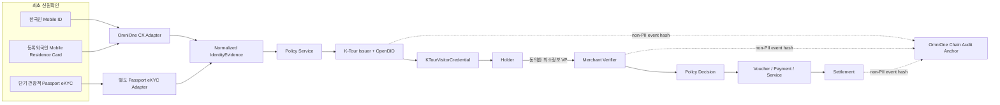
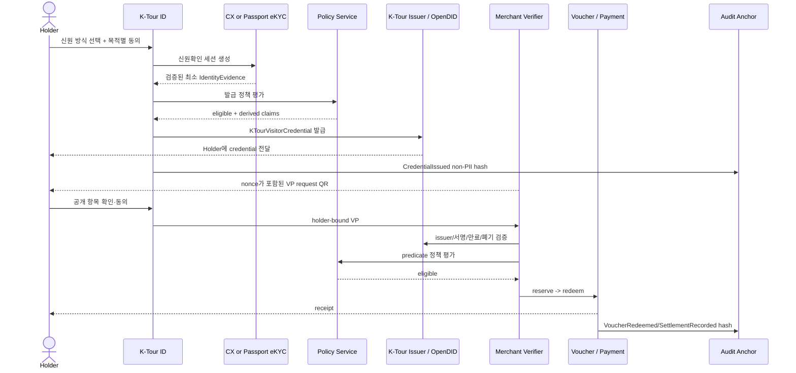

# K-Tour ID 아키텍처 요약

생산 구현 기준은 루트 [개발 명세](../../docs/DEVELOPMENT_SPEC.md)와 [Sui 연동 브리프](../../docs/SUI_INTEGRATION_BRIEF.md)다. 이 문서는 현재 목업의 발표·리뷰용 요약이며, 충돌할 경우 루트 v2 문서를 따른다.

## 1. 핵심 구조

K-Tour ID는 서로 다른 최초 신원확인 결과를 민간 서비스 자격인 `KTourVisitorCredential`로 표준화한다. K-Tour ID는 정부 신분증, 비자, 입국·체류 허가가 아니다.

### 신원 경로를 혼합하지 않는다

| 사용자 | 최초 신원확인 | 비고 |
|---|---|---|
| 한국인 | 국가 모바일 신분증 via OmniOne CX | 해커톤 필수과제의 직접 경로 |
| 등록 장기체류 외국인 | 모바일 외국인등록증 via CX | `coresidence` 환경 활성화·테스트 credential 확인 필요 |
| 단기 외국인 관광객 | 전자여권 NFC/OCR + 얼굴·라이브니스 eKYC | CX가 아닌 별도 provider; 이후 민간 K-Tour ID 발급 |

## 2. 솔루션별 정확한 역할

| 통합 지점 | 솔루션 | 책임 | 책임이 아닌 것 |
|---|---|---|---|
| `MobileIdentityAdapter` | OmniOne CX | 국가 모바일 신분증 요청·제출·검증 결과 정규화 | 단기 여행객 여권 eKYC |
| `PassportIdentityAdapter` | 별도 eKYC provider | 여권·얼굴·라이브니스 검증 결과 정규화 | 국가 Mobile ID·체류자격 발급 |
| `CredentialIssuer` / `PresentationVerifier` | OpenDID | K-Tour ID VC 발급·상태·VP 검증 | 정부 신분증·비자 발급, 여권 진위확인 자체 |
| `PolicyService` | K-Tour ID | 자격·혜택·한도 판단 | 암호학적 서명검증 |
| `Payment/Voucher/Settlement` | 별도 결제·파트너 레일 | 승인·사용·환불·중복사용 방지·정산 | chain hash만으로 결제 finality 보장 |
| `AuditAnchor` | OmniOne Chain | 개인정보 없는 이벤트 hash와 receipt | 여권·VC·결제 원문 저장, 운영 DB 대체 |

## 3. Golden sequence

## 4. On-chain / off-chain

| 위치 | 허용 | 금지 |
|---|---|---|
| OmniOne Chain | versioned event type, pseudonymous aggregate reference, canonical payload hash, timestamp, evidence reference | 이름, 생년월일, 국적 원문, 여권·외국인등록번호, 전체 DID, VC 원본, 결제 원문·설명 |
| Off-chain service | 최소화된 identity evidence, 정책결정, 결제·바우처 ledger, consent receipt | 목적 없는 장기 보관 |
| Holder / identity provider | VC, holder key, 필요 시 원본 신원 자료 | 앱 서버 로그로 개인키·원본 유출 |

해시도 재식별 위험이 있으므로 PII를 직접 해시해 올리지 않는다. 먼저 비식별 이벤트를 만들고 그 payload를 canonicalize/hash한다.

### Sui 추가 필수 레이어

Sui는 OmniOne/OpenDID를 대체하지 않는 별도 해커톤 바운티 범위다. 개발자는 Move package를 Testnet/Mainnet에 배포하고 `zkLogin`, `PTB`, `Walrus`, `DeepBook` 중 2개 이상을 실제 사용자 흐름에 통합한다. 정확한 객체·권한·가스·온체인 경계는 ADR-SUI-001에서 개발자가 정의한다.

권장 검토안은 사용자 친화적 Sui 계정에 `zkLogin`, 사용자 승인 후 AI decision/benefit execution을 한 transaction으로 묶는 `PTB`다. Walrus는 공개 가능하거나 안전하게 암호화된 비식별 provenance artifact가 필요할 때만 사용하고, DeepBook은 실제 liquidity/FX 요구가 있을 때만 사용한다. Sui/Walrus에는 PII, VC 원문, 여권·생체, 사람이 읽는 민감 결제 원문을 저장하지 않는다.

## 5. 상태와 신뢰성

- 모든 mutation에 idempotency key를 사용한다.
- 도메인 mutation과 audit outbox write는 같은 DB transaction이다.
- 체인 anchor가 지연돼도 결제·바우처의 canonical 상태는 유지하고 `Anchor pending`으로 표시한다.
- QR/VP는 nonce, domain, audience, expiry, holder binding으로 replay를 방지한다.
- voucher 중복사용은 DB의 원자적 상태전이와 unique redemption key로 막고 chain은 감사 증거로 쓴다.
- credential은 `pending -> active -> suspended/revoked/expired` 상태를 가진다.

## 6. 구현 상태를 숨기지 않는다

모든 핵심 결과는 다음 중 하나의 execution label을 갖는다.

- `LIVE`: 운영 provider receipt를 서버가 검증함
- `SANDBOX`: 공식 테스트 환경 receipt를 서버가 검증함
- `SIMULATED`: local mock/fixture이며 실제 효력이 없음

현재 저장소의 identity, VC, wallet, chain 구현은 deterministic mock이다. 실제 adapter가 붙기 전에는 다음과 같이 표시한다.

| 잘못된 표시 | 올바른 표시 |
|---|---|
| `Issuer: OmniOne (Open DID)` | `K-Tour ID Demo Issuer · SIMULATED` |
| `Recorded on OmniOne Chain` | `Local event simulation` |
| `T-money linked` | `T-money integration concept` |
| `Verified` | `Demo verification result · SIMULATED` |

## 7. P0 완료 정의

1. 실제 또는 공식 sandbox Mobile ID QR/deep link와 callback 증거가 있다.
2. Passport eKYC는 CX와 분리되고 민간 credential임을 고지한다.
3. OpenDID credential 발급과 holder 저장 증거가 있다.
4. verifier request, disclosure consent, VP validation, voucher redeem이 한 흐름으로 끝난다.
5. 만료·폐기·nonce replay·중복 redeem이 거절된다.
6. chain에는 non-PII event hash만 올라가며 receipt를 검증할 수 있다.
7. 모든 화면에서 LIVE/SANDBOX/SIMULATED가 사실과 일치한다.

환경·API·도메인·화면·테스트·미해결 질문은 [개발 핸드오프 명세](./DEVELOPER_HANDOFF.md)를 참고한다.
